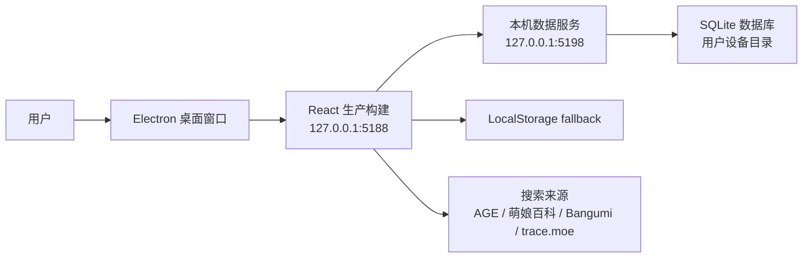

# acgn_journey 系统架构设计文档

## 1. 项目概述

acgn_journey 是一个个人 ACGN 作品记录管理软件。用户可以搜索作品、加入个人库、管理观看/阅读/游玩状态、记录评分短评、维护实体库存，并通过时间线和统计面板回顾自己的 ACGN 历程。

v0.7 的核心定位是本地桌面软件：Electron 提供窗口入口，本机静态运行时提供 React/Vite 的生产构建文件，Node 本机数据服务负责把数据写入用户设备中的 SQLite 数据库。GitHub Pages 保留为在线演示入口。

## 2. 技术选型

| 层面 | 选择 | 理由 |
|------|------|------|
| 桌面壳 | Electron | 快速把现有 Web 应用落地为本地软件 |
| 前端框架 | React 19 + Vite 7 | 快速 HMR、原生 ESM、维护成本低 |
| 样式方案 | 原生 CSS + CSS Variables | 主题切换简单，依赖少 |
| 状态管理 | React Hooks | 当前业务规模下足够清晰 |
| 数据持久化 | Node 本机服务 + SQLite | 数据保存在用户设备，不依赖浏览器缓存 |
| 图标 | Lucide React | 轻量、风格统一 |
| 搜索集成 | 单来源 adapter + 可选代理 fallback | 更接近 anime_trace 的单站点检索模型 |
| 测试 | Vitest | 覆盖搜索归一化、导入与路由逻辑 |

## 3. 运行时架构



桌面模式启动链路：

1. 用户运行 `npm run desktop:start`。
2. `scripts/desktop.mjs` 检查依赖、本机数据服务和前端运行时。
3. 若服务未运行，启动 `scripts/local-data-server.mjs` 和本机静态应用运行时。
4. 启动 Electron，并加载本机前端地址。
5. 用户关闭窗口后，启动器收掉自己创建的子进程。

浏览器开发模式：

1. 用户运行 `npm run app` 或 `npm run app:start`。
2. `scripts/dev-server.mjs` 启动本机数据服务和 Vite，并打开浏览器。
3. `npm run app:stop` 可停止两者。

在线演示模式：

1. GitHub Pages 发布静态前端。
2. 页面无法启动本机进程。
3. 本机数据服务不可用时，前端自动回退到 LocalStorage。

## 4. 数据模型

### 4.1 LibraryRecord

```typescript
interface LibraryRecord {
  id: string;
  workKey: string;
  source: string;
  sourceId: string;
  sourceUrl: string;
  title: string;
  originalTitle: string;
  cover: string;
  type: string;
  summary: string;
  releaseDate: string;
  releaseYear: string;
  status: 'wish' | 'active' | 'done' | 'paused' | 'dropped';
  rating: number;
  comment: string;
  tags: string[];
  animeTags: string[];
  startedAt: string;
  finishedAt: string;
  addedAt: string;
  updatedAt: string;
  inventory: Inventory;
}
```

### 4.2 Inventory

```typescript
interface Inventory {
  owned: boolean;
  format: 'light-novel' | 'bd' | 'game-disc' | 'game-card' | 'goods' | 'other';
  purchasePrice: string;
  purchaseChannel: string;
  shelfLocation: string;
  limitedEdition: boolean;
  openStatus: 'unknown' | 'sealed' | 'opened';
  purchasedAt: string;
  notes: string;
}
```

### 4.3 SearchWork

```typescript
interface SearchWork {
  id: string;
  source: string;
  sourceLabel: string;
  sourceId: string;
  sourceUrl: string;
  title: string;
  originalTitle: string;
  cover: string;
  type: string;
  summary: string;
  releaseDate: string;
  releaseYear: string;
  tags: string[];
  animeTags?: string[];
  meta: string[];
}
```

## 5. 数据持久化

本机数据服务 API：

| 方法 | 路径 | 说明 |
|---|---|---|
| `GET` | `/api/local/health` | 健康检查，返回数据库路径和记录数 |
| `GET` | `/api/local/records` | 读取作品库 |
| `PUT` | `/api/local/records` | 覆盖写入作品库 |
| `GET` | `/api/local/settings/:key` | 读取设置 |
| `PUT` | `/api/local/settings/:key` | 写入设置 |
| `DELETE` | `/api/local/settings/:key` | 删除设置 |

前端策略：

- `useLibrary` 先从浏览器缓存快速初始化，再尝试读取 SQLite。
- SQLite 有数据时以 SQLite 为准。
- SQLite 为空但浏览器已有记录时，会迁移当前记录到 SQLite。
- 后续变更优先保存到 SQLite，同时保留浏览器 fallback。
- 背景与主题偏好同样优先写入本机设置表。

## 6. 搜索架构

`src/search/` 负责搜索来源适配：

```text
src/search/
  sources.js
  searchService.js
  html.js
  adapters/
    age.js
    bangumi.js
    moegirl.js
    traceMoe.js
```

策略：

- UI 只维护一个当前来源。
- `searchSource(sourceId, keyword)` 调度对应 adapter。
- adapter 负责请求、解析 HTML/JSON，并归一化为 `SearchWork`。
- 当前来源失败时只显示当前来源错误，不再混合多个来源的失败信息。
- trace.moe 截图识别独立于文字搜索来源。

## 7. 主要组件

```text
App
  Topbar
  SearchPanel
  TraceMoePanel
  LibraryPanel
  InventoryPanel
  BulkImportPanel
  TimelinePanel
  StatsPanel
  RecordEditor
  ConfirmModal
  SettingsPopover
  FloatingToolbar
```

关键 Hook：

- `useLibrary`：作品库状态、SQLite 同步、批量更新与删除。
- `useBackground`：背景图片、透明度、模糊度与本机设置同步。

关键工具：

- `src/utils/library.js`：记录归一化、JSON/XML/CSV 备份导出、JSON 备份读取、状态/分类工具。
- `src/utils/localApi.js`：本机数据服务客户端。
- `src/utils/stats.js`：统计与筛选。
- `src/utils/importers.js`：本项目 JSON 备份、CSV 与 XML 导入。

## 8. 文件结构

```text
acgn_journey/
  electron/
    main.mjs
  scripts/
    desktop.mjs
    dev-server.mjs
    local-data-server.mjs
    tag_wordcloud.py
  src/
    App.jsx
    main.jsx
    components/
    hooks/
    search/
    utils/
  worker/
  docs/
  package.json
  vite.config.js
```

## 9. 安全与边界

- Electron 禁用 `nodeIntegration`，启用 `contextIsolation` 和 `sandbox`。
- 本机数据服务默认只监听 `127.0.0.1`。
- CORS 只允许 loopback 与已知线上来源。
- 搜索代理只保留固定白名单前缀，不接收任意上游 URL。
- 外部链接在 Electron 中通过系统浏览器打开。
- 图片背景保存在本机设置中，不上传云端。

## 10. 后续方向

- 增加打包能力，例如 `electron-builder`，输出 Windows 安装包或免安装包。
- 为本机 SQLite 增加自动备份/恢复入口。
- 增加数据迁移版本表，便于未来 schema 演进。
- 增加安装包构建流程，把当前本机启动链路封装为双击运行的可执行软件。
