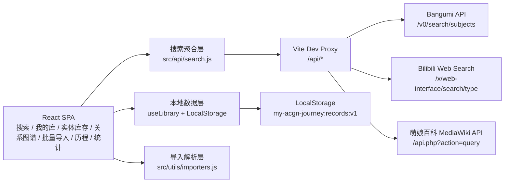

# My ACGN Journey 架构设计

## 目标

My ACGN Journey 是一个个人向 ACGN 作品历程管理 SPA，用来把动画、轻小说、Galgame、百科条目从外部站点检索进来，并沉淀为用户自己的观看、阅读、游玩记录。

## 系统架构



当前实现优先保证单页应用可独立运行，后端只承担开发阶段跨域代理职责。生产化时，可以把 `src/api/search.js` 的相对请求保持不变，将 `/api/*` 交给 Express 或 Serverless 代理。

## 前端模块

- `src/App.jsx`：应用外壳、主导航、全局 toast、编辑器挂载。
- `src/api/search.js`：多源搜索聚合、外部数据标准化、错误隔离。
- `src/hooks/useLibrary.js`：本地库增删改查和持久化。
- `src/utils/library.js`：状态标签、作品分类、作品年份、记录创建、标签标准化、备份读写工具。
- `src/utils/importers.js`：Bangumi/MAL/AniList/VNDB/通用 CSV 与 MAL XML 的导入解析。
- `src/utils/stats.js`：筛选、分布统计和总览指标。
- `src/components/SearchPanel.jsx`：搜索输入、来源切换、结果列表。
- `src/components/LibraryPanel.jsx`：作品库列表、筛选、编辑/删除入口。
- `src/components/InventoryPanel.jsx`：实体库存筛选、估算投入、快速加入和藏品卡片。
- `src/components/RelationGraphPanel.jsx`：作品关系录入、SVG 节点图和关系列表。
- `src/components/BulkImportPanel.jsx`：批量导入文件选择、解析预览、合并/覆盖入口。
- `src/components/TimelinePanel.jsx`：按年份分组的历程视图。
- `src/components/StatsPanel.jsx`：类型、年份、状态、评分统计。
- `src/components/RecordEditor.jsx`：记录编辑弹窗。

## 外部搜索源

### Bangumi

请求：

```http
POST /api/bangumi/v0/search/subjects?limit=12&offset=0
Content-Type: application/json
```

请求体：

```json
{
  "keyword": "关键词",
  "sort": "match",
  "filter": {
    "type": [1, 2, 4],
    "nsfw": false
  }
}
```

类型映射：

- `1`：轻小说/书籍
- `2`：动画
- `4`：Galgame/游戏

### Bilibili

请求：

```http
GET /api/bilibili/x/web-interface/search/type?search_type=media_bangumi&keyword=关键词&page=1
```

这个接口属于 B 站 Web 搜索接口，稳定性弱于正式开放 API，所以搜索聚合层会把失败隔离为来源级 warning，不影响 Bangumi 和萌娘百科结果。

### 萌娘百科

请求：

```http
GET /api/moegirl/api.php?action=query&generator=search&prop=extracts|pageimages|info&...
```

通过 MediaWiki API 获取页面标题、摘要、缩略图和页面链接。百科条目不一定都是作品，因此统一标记为 `百科条目`。

## 标准化搜索结果模型

```ts
type SearchWork = {
  id: string;
  source: 'bangumi' | 'bilibili' | 'moegirl';
  sourceLabel: string;
  sourceId: string;
  sourceUrl: string;
  title: string;
  originalTitle: string;
  cover: string;
  type: string;
  summary: string;
  releaseDate: string;
  releaseYear: string;
  tags: string[];
  meta: string[];
};
```

## 用户库记录模型

```ts
type LibraryRecord = {
  id: string;
  workKey: string;
  source: string;
  sourceId: string;
  sourceUrl: string;
  title: string;
  originalTitle: string;
  cover: string;
  type: string;
  summary: string;
  releaseDate: string;
  releaseYear: string;
  status: 'wish' | 'active' | 'done' | 'paused' | 'dropped';
  rating: number;
  comment: string;
  tags: string[];
  inventory: InventoryInfo;
  relations: WorkRelation[];
  startedAt: string;
  finishedAt: string;
  addedAt: string;
  updatedAt: string;
};

type InventoryInfo = {
  owned: boolean;
  format: 'light-novel' | 'bd' | 'game-disc' | 'game-card' | 'goods' | 'other';
  purchasePrice: string;
  purchaseChannel: string;
  shelfLocation: string;
  limitedEdition: boolean;
  openStatus: 'unknown' | 'sealed' | 'opened';
  purchasedAt: string;
  notes: string;
};

type WorkRelation = {
  id: string;
  targetId: string;
  type: 'series' | 'same_world' | 'same_creator' | 'adaptation' | 'spinoff' | 'other';
  note: string;
};
```

状态文案会根据作品类型显示：

- 动画：想看 / 在看 / 已看
- 书籍：想读 / 在读 / 已读
- 游戏/Galgame：想玩 / 在玩 / 已玩
- 通用：搁置 / 抛弃

## 数据持久化

当前使用浏览器 `LocalStorage`：

```text
key: my-acgn-journey:records:v1
value: LibraryRecord[]
```

优点是部署简单、离线可用；限制是多设备同步、备份、批量导入导出尚未实现。后期扩展后端时，建议保持 `LibraryRecord` 结构不变，新增用户表和同步版本字段。

v0.1 已加入本地 JSON 备份，v0.2 起备份会同时包含实体库存和关系图谱字段：

```ts
type BackupPayload = {
  app: 'My ACGN Journey';
  version: '0.2';
  exportedAt: string;
  recordCount: number;
  records: LibraryRecord[];
};
```

导入备份时也兼容直接导入 `LibraryRecord[]`。当前导入策略是覆盖恢复，适合做完整备份/还原；后续可以扩展为“合并导入”。

## v0.2 批量导入

`src/utils/importers.js` 提供离线文件解析：

- CSV：通过常见表头别名映射标题、类型、平台 ID、状态、评分、短评、标签、开始/完成日期、作品年份等字段。
- MyAnimeList XML：兼容 `<anime>` 与 `<manga>` 导出块，读取 `series_title`、`series_type`、`my_status`、`my_score`、`my_tags` 等字段。
- 导入策略：界面支持“合并到现有库”和“覆盖当前库”。合并时以 `workKey` 为主键，后导入的同平台同 ID 条目会覆盖旧条目。
- 授权 API 同步：界面已预留说明入口。生产化时建议新增后端保存平台授权凭据、处理回调、刷新登录状态，并由前端调用本地 `/api/sync/:provider`。

## 后端扩展建议

可新增 Express 服务：

- `GET /api/search?q=&sources=`：聚合搜索并缓存短期结果。
- `GET /api/records`：读取用户库。
- `POST /api/records`：新增记录。
- `PATCH /api/records/:id`：更新记录。
- `DELETE /api/records/:id`：删除记录。

数据库可选 SQLite/PostgreSQL。最小表结构：

```sql
CREATE TABLE works (
  id TEXT PRIMARY KEY,
  source TEXT NOT NULL,
  source_id TEXT NOT NULL,
  source_url TEXT,
  title TEXT NOT NULL,
  original_title TEXT,
  cover TEXT,
  type TEXT,
  summary TEXT,
  release_date TEXT,
  release_year TEXT,
  UNIQUE(source, source_id)
);

CREATE TABLE library_records (
  id TEXT PRIMARY KEY,
  work_id TEXT NOT NULL REFERENCES works(id),
  status TEXT NOT NULL,
  rating INTEGER DEFAULT 0,
  comment TEXT DEFAULT '',
  tags TEXT DEFAULT '[]',
  started_at TEXT,
  finished_at TEXT,
  added_at TEXT NOT NULL,
  updated_at TEXT NOT NULL
);
```

## 跨域与稳定性

- 开发阶段：Vite proxy 解决浏览器 CORS，页面只请求 `/api/*`。
- 生产阶段：静态站无法直接复用 Vite proxy，需要部署真实代理。
- Bilibili 和萌娘百科可能出现限流、反爬或结构变化，聚合层会将失败降级为 warning。
- Bangumi v0 搜索 API 标注为实验性，字段变化时只需要调整 `normalizeBangumiItem`。
